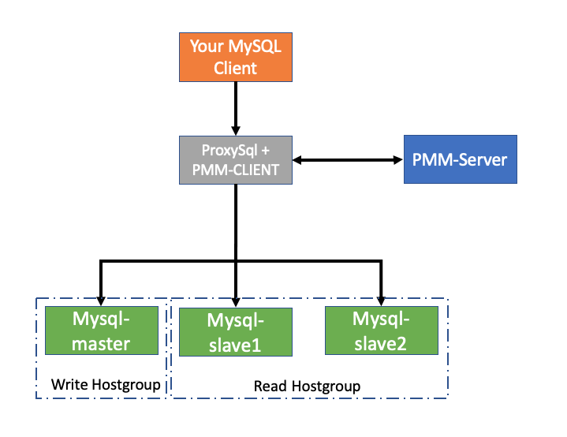

ProxySQL/PMM/MySQL Docker cluster
==============================================
[](https://raw.githubusercontent.com/taherbs/ProxySQL-PMM-MySQL_docker_cluster/master/LICENSE)

This repository contains a docker-compose.yml used to launch a small cluster consisting of 3x
MySQL 5.7 containers (1x Master and 2x Slaves), a ProxySQL 2.0.4 container and and a Percona Monitoring and Management server (PMM SERVER) all connected  via a lan network.
* ProxySQL is automatically configured with 2x hostgroups, a writer hostgroup used as the default hostgroup and a reader hostgroup for all SELECT statements.
* PMM monitoring can enabled/disabled from the docker-composer b changing the value of the "ENABLE_PMM_MONITORING" env variable.

Bellow is displayed a simplified diagram of the project architecture:


### Config and Pre-requisites

The MySQL and ProxySQL have separate directories with their respective configuration
in the conf directory. You can override any of the MySQL 5.7 variables by editing the `my.cnf` located
in the respective subdirectory under `conf` for each container (i.e. `conf/mysql/mysqlmaster/my.cnf`,
`conf/mysql/mysqlslave1/my.cnf`, `conf/mysql/mysqlslave2/my.cnf`). Its also possible to edit the ProxySQL config or the PMM client config script files as needed.

Note that you'll need the following pre-requisites installed on your host machine:
- docker-ce / docker-ee (17.12+ required)
- docker-compose (1.19+ required)
- mysql-client (5.7+ required)
- sysbench (1.0.12+ recommended if benchmarking)


### Usage

```bash
# To start the cluster:
make init

# To delete the cluster:
make delete

# To reload the cluster after config changes:
make reload
```

### Testing and Benchmarking
You can run benchmarking to simulate different SQL queries ( DROP/CREATE/UPDATE/SELECT) on the sysbench database.

```bash
# To run benchmarking:
make test
```

### PMM Dashboards


* Access Prometheus: http://localhost:8080/prometheus
* Access Graphana: http://localhost:8080/graph
* Access Qan: http://localhost:8080/qan


### Useful ProxySQL commands
Bellow some useful SLQ commands that could be run on the ProxySQL server to collect different type of stats:

```bash
# Connect to the ProxySQL DB
mysql -h "127.0.0.1" -u radmin -p'radmin' -P 16032

# Show top 5 queries based on total execution time:
SELECT digest,SUBSTR(digest_text,0,25),count_star,sum_time FROM stats_mysql_query_digest WHERE digest_text LIKE 'SELECT%' ORDER BY sum_time DESC LIMIT 5;

# Show the top 5 queries based on count:
SELECT digest,SUBSTR(digest_text,0,25),count_star,sum_time FROM stats_mysql_query_digest WHERE digest_text LIKE 'SELECT%' ORDER BY count_star DESC LIMIT 5;

# Show the top 5 queries based on maximum execution time:
SELECT digest,SUBSTR(digest_text,0,25),count_star,sum_time,sum_time/count_star avg_time, min_time, max_time FROM stats_mysql_query_digest WHERE digest_text LIKE 'SELECT%' ORDER BY max_time DESC LIMIT 5;

# Check how much times each rule have been executed
SELECT * FROM stats_mysql_query_rules;

# Check queries count categorized by command type
SELECT * FROM stats_mysql_commands_counters;

# Check servers connection logs
SELECT * FROM mysql_server_connect_log;
SELECT * FROM mysql_server_ping_log;
SELECT * FROM mysql_server_read_only_log;
```

### Useful Documentation links
* [ProxySql Documentation](https://github.com/sysown/proxysql/wiki)
* [Percona ProxySql blog posts](https://www.percona.com/blog/category/proxysql/)
* [PMM Documentation](https://www.percona.com/doc/percona-monitoring-and-management/architecture.html)
* [pondix git docker-mysql-proxysql project](https://github.com/pondix/docker-mysql-proxysql)
